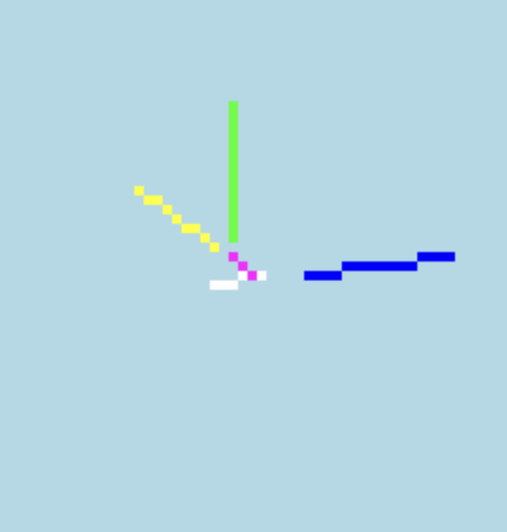
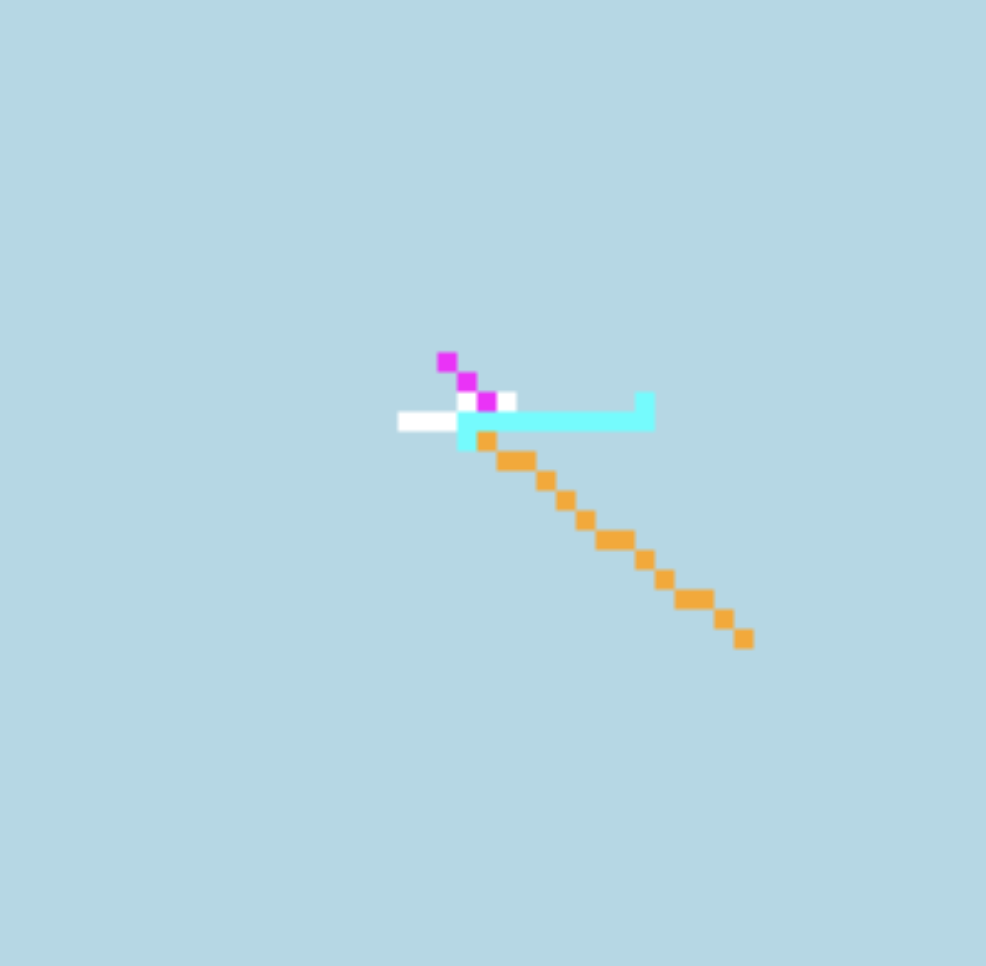
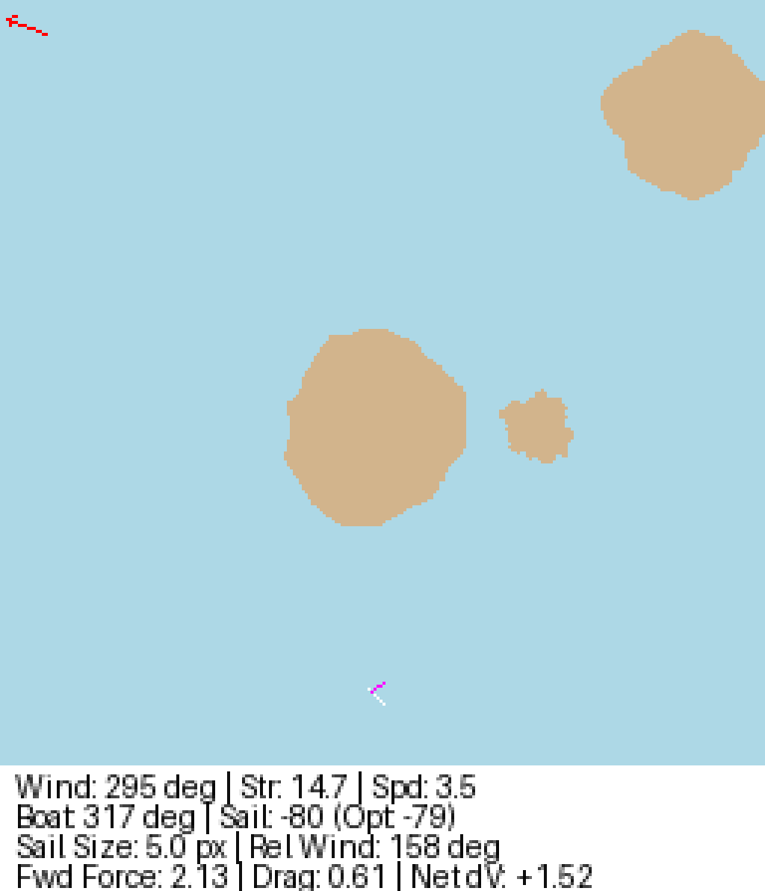

# World Model Sailing Project

## Project Outline
The goal of this project is to train an AI model to steer a simple sailboat. The AI acts as a virtual captain and uses a "World Model" made of three basic parts: Vision (to see the map), Memory (to remember past movements), and a Controller (to make decisions). 

The simulation runs on a 256x256 2D grid representing the ocean. The boat always starts near the bottom center of the map and must safely navigate around obstacles to cross a finish line at the northern edge.

## The Boat
The AI controls the boat by changing its heading (turning) and adjusting the sail's angle and size. 
* The boat is visually represented as being 7 pixels long and 1 pixel wide.
* The sail can change size dynamically between 3 and 6 pixels long.
* The physics engine calculates the boat's speed based on the wind direction, the sail angle, and water drag. 
* The boat faces realistic consequences: it can drift backward if turned directly into the wind, or capsize completely if strong side winds hit a fully extended sail.

    

**Figure 1.1: Environmental and Navigational Vector Overlay**  
*(For file: vector.png)*  
> The simulated navigational vectors acting on the boat. The true environmental wind direction and strength (green) and the boat's current heading and velocity (blue). The current sail trim (magenta) contrasted against the optimal sail angle for maximum wind capture (yellow).

    

**Figure 1.2: Resultant Force and Forward Drive Vectors**  
*(For file: forces.png)*  
> The orange vector (total resultant force) is generated by combining the boat's current momentum with the wind forces acting on the sail. The cyan vector (the final calculated forward drive applied to the vessel) is derived after accounting for efficiency and hydrodynamic drag.

## The Environment
Every training run generates a brand new map so the AI learns to generalize instead of just memorizing one specific route.

    

World Model Sailing Project

* **Landmasses:** Islands are procedurally generated using noise algorithms. There will be between 2 and 11 islands per map, covering a maximum of 25% of the screen. They are spaced out so the boat always has a valid path.
* **Wind:** Wind direction and strength are randomized at the start of each run but remain constant for the entire simulation. The wind is displayed as a red arrow in the top left corner of the screen.
* **Rewards & Penalties:** The AI receives a +100 point reward for successfully crossing the finish line. It receives a -50 point penalty if it crashes into an island, goes out of bounds, or capsizes. 

## Project Variables
At any given time, the simulation tracks the following telemetry values:
* Wind Direction and Wind Strength
* Boat Heading and Boat Speed (Velocity)
* Sail Angle and Sail Size
* Boat Location (X and Y coordinates)

## Desired Outcomes
* The AI learns how to travel upwind efficiently by using zig-zag patterns (tacking).
* The AI balances speed with caution to avoid capsizing under heavy wind stress.
* The boat successfully navigates random, procedurally generated islands without crashing.
* The system effectively uses the wind and boat direction to calculate optimal sail angles and manage drag.